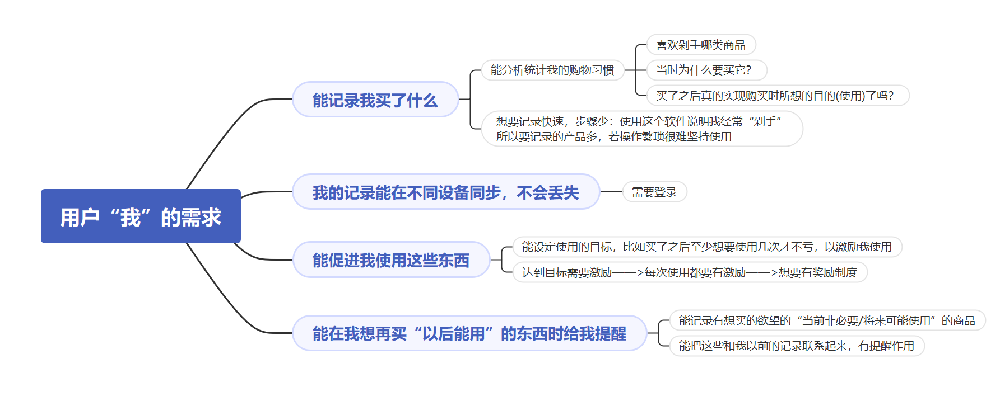
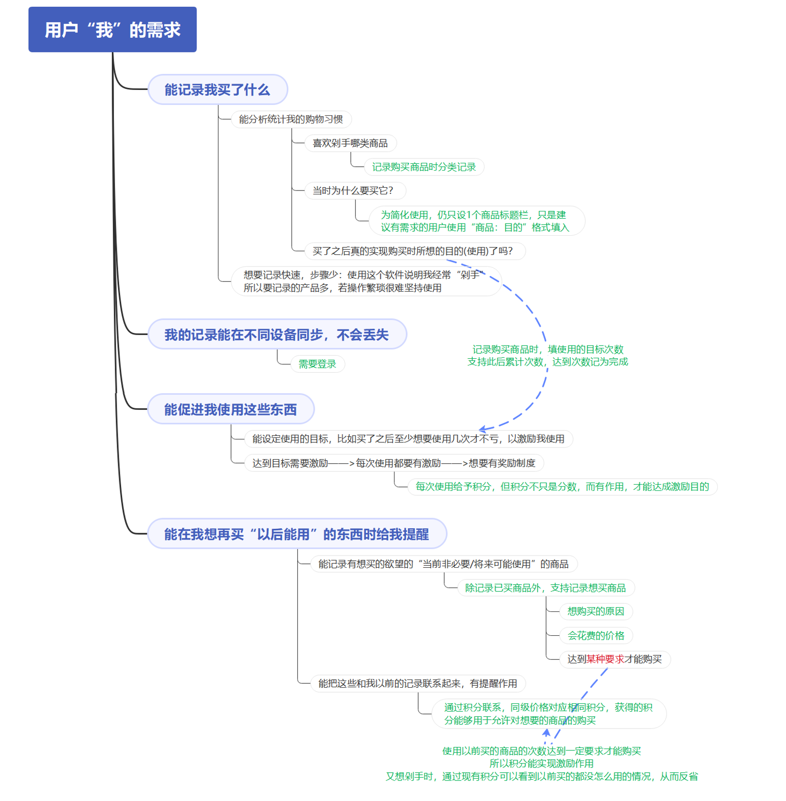

# 引言

该文件为微信小程序 “Stop Buy, Get Desire!”的需求分析文档。

Stop Buy, Get Desire! 是一款与众不同的“剁手党”管理工具，结合游戏机制，促使用户更积极地使用曾因“我可能会用到”而花钱买入的物品，避免最终闲置浪费，同时以积分/等级/实际价格等对应方式，能直观感受到自己的剁手程度，遏制剁手的欲望——

若想要购入“喜欢而使用性差”的物品，就要掂量掂量从前花钱买入的等价位商品是否有投入使用？或许看一看曾经已经购买的“喜欢而使用性差”的物品的使用次数与频率，就会打消当前购买的欲望呢！

# 目录

[TOC]

# 简介

## 开发背景

生活中，剁手党（包括我）常常因以下原因，购入许多仅在当前看起来有用的商品。

1. 大促
2. 一时喜欢，缺乏理性思考
3. 自我催眠**“我以后会用到的”**
4. 等等

而他们最终的归宿都是使用一两次后就在角落里蒙尘，最终只能送人、二手折价卖掉、或者直接扔掉，因此存在以下问题：

1. 浪费金钱
2. 无用的物品占据空间、影响家里的整洁度

## 开发目的与意义

> 目的

该小程序针对上述生活场景提供了缓解方法。

> 目标用户

**有改变现状意识的、存在主动性的**“剁手党”。

> 意义

- 用户可使用该小程序主动记录**因“以后可能会用到”而忍不住剁手买下的物品**的相关信息，当然，这类物品需由用户主观判断
- 从而用户能直观地分析自己的行为特点，比如：
  1. 经常忍不住剁手的商品的价格段
  2. 经常忍不住剁手的商品的类别
  3. 对自己“可能会用到”的判断的准确性：根据使用情况等
- 提供积分机制
  1. 用积分激励用户对这类商品的使用
  2. 积分有以上效用的原因在于，它被设定成能够用于“允许”用户购入相应价格段的同类商品的“钞票”

# 开发环境

| 考虑因素      | 需求                                                         | 否决                | 选定                                                         |
| :------------ | :----------------------------------------------------------- | ------------------- | ------------------------------------------------------------ |
| 实现形式      | 1.用户需求：操作方便，打开迅速 2.使用设备需求：不限，提高普及度 3.使用频率需求：“实时记录” 4.实施：避免用户因繁琐弃用 | PC端：网页/本地程序 | 形式：微信小程序 原因： 1.微信自动提供不同设备的小程序界面适配 2.微信使用广，无需下载新程序 |
| 开发平台/版本 | 1.编程人员需求：新手入门，需按时完成小作业 2.实际情况：官方文档最可靠  | 旧版本、测试版      | 微信开发者工具 stable 1.05.2103200 原因：现有官方文档适配最新版开发平台 |
| 开发语言      | 开发平台：基于微信开发者工具                                 | -                   | 实现语言： 1.后端：js 2.前端：wxml+wxss            |
| 开发系统      | -                                                            | -                   | 系统：win10                                                  |

# 用户需求

本软件出自我个人的需求而开发，因此我以“我”为用户出发考虑“我”的需求，一步步在基本程序上对应特定用户需求添加所需功能，使用思维导图分析如下：

# 功能需求

## 需求分析

根据用户的每项功能需求，针对性地提出小程序所需功能，分析过程及对应关系如下思维导图所示。

其中，$\color{green}{绿色}$ 分支为对应特定用户需求提出的软件功能需求：

## 实现模块

根据以上功能需求分析，该小程序需实现为四大模块：

1. `注册与登录`
2. `我的`：用户信息查看，积分/等级/历史操作记录
3. `主页-任务列表`：已剁手商品与使用情况记录
4. `主页-欲望商店`：期待剁手商品记录与管理

## 功能清单

### 注册与登录

1. 初次使用：提示用户授权微信账号注册与登录
2. 再次使用：已授权微信账号可直接使用
3. 账号信息同步：随同一微信账号在不同设备同步

### 我的

主要功能：用户信息查看，如积分/等级/历史操作记录

> 显示个人信息

- [ ] 头像
- [ ] 昵称等级
- [ ] 积分

> 积分账单查看

- [ ] 分类查看
  1. 全部
  2. 收入（使用）
  3. 支出（购买）
- [ ] 显示积分/项目信息

> 使用帮助

> 关于我们

### 主页-任务列表

主要功能：已剁手商品与使用情况记录

> 三类商品顶部tab标签分开查看

- [ ] 日用品
- [ ] 衣物饰品
- [ ] 学习用品

> 分类显完成/未完成使用次数的商品

> 列表形式显示商品信息

- [ ] 商品名与购买原因/目的

- [ ] 已使用次数/预期使用次数

- [ ] 购入金额

- [ ] 使用一次可获得积分

  后台根据购入金额计算并显示可获得积分如下：

  ¥0~ ¥ 10: 1
  ¥10~ ¥100: 2
  ¥100~ ¥500: 4
  ¥500~ ¥1000: 6
  ¥1000~: 8

> 添加已剁手商品：单按钮按下，需填写内容如下

- [ ] 商品名与购买原因/目的
- [ ] 商品类型：日用品、衣物饰品、学习用品
- [ ] 购入后期待使用次数
- [ ] 花费金额
- [ ] 期待使用次数的截止日期（除日用品）

> 记录已添加商品的每次使用

- [ ] 单击即记录一次使用，无需确认

- [ ] 使用一次为用户增加响应积分与经验（数值相等）

- [ ] 总经验达到一定数量时升级

  1级：10积分
  2级：30积分
  3级：50积分
  4级：80积分
  5级：100积分

- [ ] 达到预期使用数量，商品进入“已完成”列表

- [ ] 过期（除日用品）未达到预期使用次数，日期标红，但可继续点击记录使用

> 左滑删除商品

### 主页-欲望商店

主要功能：期待剁手商品记录与管理

> 列表形式显示商品信息

- [ ] 商品名与想购买的原因/目的
- [ ] 商品价格
- [ ] 允许购买该商品所需积分

> 添加期待剁手的商品

- [ ] 商品名与想购买的原因/目的
- [ ] 商品价格

> 排序

- [ ] 按商品实际价格升序排序

> 单击确定购买商品

- [ ] 需确认
- [ ] 确认后从列表中移除该商品
- [ ] 相应减少积分
- [ ] 积分不足时提醒